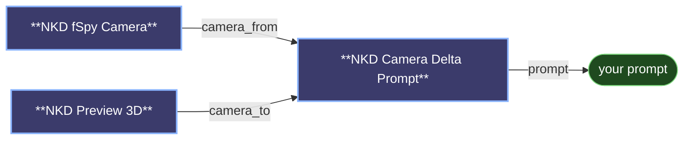

# 😺NKD Camera Delta Prompt

Writes the move between two cameras as the JSON a *"the camera has moved by: {...}"*
LoRA expects, dropped straight into your prompt.

- `camera_from` is where the shot started, usually the solved plate camera or the
  `camera_info` you fed into Preview 3D. `camera_to` is where you moved to, usually
  Preview 3D's `camera_info` output after unlocking the camera and orbiting.
- `template` is your prompt, with `{camera}` replaced by the JSON. Leave the token
  out and the prompt comes back unchanged; set the template to just `{camera}` and
  you get the JSON on its own.
- `space` picks the frame for x/y/z. `camera` uses the FROM camera's own axes, so
  the numbers read as "moved right / up / back". `world` uses raw scene axes.
- `scale` multiplies x/y/z. Your scene units are almost certainly not the LoRA's,
  and this is the dial for that.
- `decimals` (default 3) sets the precision. Trailing zeros are dropped, so an
  unmoved camera always prints a clean zero whatever you set here.
- `flip_z` is the first thing to try when the repair pushes the scene the wrong way.
- `flip_rotation` is for when the camera turns the opposite way to what you asked.
  To reverse the move entirely, swap the two camera cables instead.

One honest caveat: nobody published which space the LoRA was actually trained on, so
`world` is unverified. Try both and keep whichever repairs your shot.

---

[← All 😺NKD VFX Tools nodes](../README.md)
