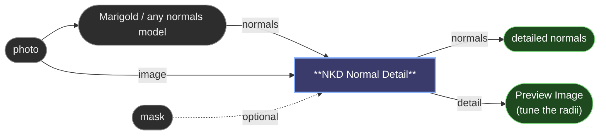

# 😺NKD Normal Detail

A normal map from a model (Marigold, DSINE, any of them) gets the big shape
right and loses everything small: pores, stubble, single hairs come out as one
smooth surface. A normal derived from the photo itself has exactly that detail
and a big shape that is garbage, because it reads brightness as height. This
node takes both, keeps the shape from the first and the texture from the second.

> The detail is band-passed before it becomes slopes. Differentiating the photo
> straight turns its lighting into fake relief; here each band keeps only the
> frequency its radius lets through, and the base map supplies the rest.

- **`normals`** is the base map, **`image`** the photo the detail is read from.
  They do not need to be the same size.
- **Resolution** decides the working size. `image` outputs at the photo's size:
  the base is upscaled and re-normalised, and the detail is read at full
  resolution, which is where the pores live. `normals` outputs at the base's size
  with the photo downscaled. Radii are in pixels of that working size, so an
  aspect mismatch gets a warning in the console rather than a silent stretch.
- **Amount** is how much detail lands on the base. 0 hands the base back exactly.
- **Blend** is how the two are combined. `Reoriented` rotates the detail onto the
  base's surface, so a pore on the jaw tilts with the jaw; it is the right one
  and the default. `UDN` adds the slopes and keeps the base's depth, a bit
  flatter on steep areas. `Overlay` is the per-channel Photoshop blend, there so
  you can compare with the hand-made version.
- **Fine Radius / Strength** and **Medium Radius / Strength** are the two
  bands: fine for pores and stubble, medium for wrinkles, hair locks and fabric
  weave. A radius of 0 switches that band off.
- **Noise Reduction** blurs the photo a little before reading it, so grain and
  compression blocks do not become bumps.
- **Flip Detail Y** inverts the detail's green channel for a DirectX-style base.
  The base itself passes through untouched.
- **`mask` input** confines the detail, feathered by its values.

The **`detail`** output is the micro-detail map on its own. Wire it to a
Preview Image while you tune the radii: it shows what each band is picking up
without the base in the way.

Brightness is not height. A dark freckle reads as a dent and a specular
highlight as a bump. On skin and hair that goes unnoticed; on a printed
pattern it will not.

---

[← All 😺NKD VFX Tools nodes](../README.md)
