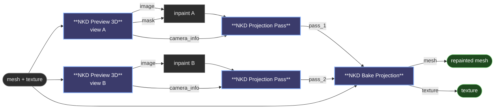

# 😺NKD Projection Pass / Bake Projection

Paint a 3D model by inpainting pictures of it. Frame a view in
[😺NKD Preview 3D](preview-3d.md), send the render through whatever inpaint you
like, and these two nodes put the result back on the mesh, from the same camera
it was rendered with, so nothing has to be lined up by hand.

> Every view is one cable, and the merge happens once. Views do not stack up run
> after run: they all land in a single bake, so the result does not depend on the
> order you painted in, and changing how the views blend re-bakes all of them at
> once instead of starting over.

## How you work with it

One group per view: a Preview 3D framing the angle, your inpaint, and a
Projection Pass. Every group's cable goes into the same bake node, and you
duplicate the group for the next angle. Each Preview 3D keeps its own camera in
the workflow, so those groups double as your saved viewpoints.

Ctrl+M is the per-view switch. A pass slot fed by a muted group is skipped rather
than failing the bake, so you can build five groups, mute them all, and wake them
one at a time as you work round the model.

Feed the bake's `mesh` output back into a Preview 3D to look at what you have.

To decide exactly which part of the model gets inpainted, paint it once in 3D in
the Preview 3D (the pencil in its view tools). Its `paint_mask` output is then the
inpaint mask for whatever angle you frame, and its `mask3d` output goes into the
Projection Pass so nothing outside that region is ever touched by that view.

## 😺NKD Projection Pass

Packages one edited view together with the camera that rendered it.

- `image` is the edited view, `camera_info` the camera it came from, and they
  have to be the same Preview 3D with nothing moved in between. Resolution may
  differ from the render: the projection is normalised, so an upscaled or
  sampler-rounded edit still lands.
- `silhouette` is where the render has model at all, straight from the `mask` output
  of the same Preview 3D. Wire it. Not Load3D's `mask`: that output is not a
  silhouette (on a full-frame head it covered 7% of the picture), and it would
  reject most of what you painted. A render is a model on a backdrop, and every
  pixel of that backdrop is a colour the model never had; without this gate a
  surface that projects just off the model, or onto a gap in it, gets painted with
  the backdrop.
- `silhouette_erode` pulls that edge in, default 4 pixels. The edge pixels are a
  blend of model and backdrop, and they sit where the surface is most edge on,
  which is where a projection is least worth trusting.
- `mask` is where this pass may paint, normally the same mask you inpainted with.
  Wire it. Without a mask the whole view projects, and every pass overwrites good
  colour with re-rendered colour; with one, passes accumulate retouches instead
  of fighting each other.
- `feather` softens that mask inwards, so the blend never reaches geometry you
  did not paint. Default 8.
- `weight` is how much say this pass gets in the merge. 0 mutes it without
  unwiring.
- `mask3d` is the geometry this view may paint: a mask painted on the model in
  the Preview 3D. The 2D `mask` says where in the picture to project; this one
  says what receives it, wherever the pixels land. It is what stops the skin of a
  face landing on the shoulders behind it. Per pass, so each view can have its
  own container. It has to come from the same mesh you bake.
- `mirror` also paints this view across the model's symmetry plane, in its own
  space: `X` mirrors left and right. It is per pass on purpose. A frontal view
  already covers both sides, and mirroring it only doubles it up; the side view
  is the one to reflect, so one pass does both headlights of a car, or carries
  the near side of a head to the far side. It mirrors the geometry, not the
  atlas, so any UV layout works, and it follows the Load3D placement. It assumes
  the model really is symmetric about that plane; the Preview 3D's mirror guide
  shows you whether it is.

## 😺NKD Bake Projection

Merges every pass onto the mesh, all at once. When the mesh has a UV layout,
which is what Trellis2 and Pixal3D give you, it repaints the texture on that same
layout. A mesh with no UVs gets vertex colours instead, and the report says which
of the two ran.

- `passes` grows a fresh slot as you wire one, up to eight.
- `model_3d_info` is the placement the viewport rendered at, from the same Load3D
  that fed it. Wire it whenever the viewport has it. Without it the bake projects
  onto the mesh where its own coordinates put it, which is not where the camera
  saw it, and the paint lands somewhere else entirely.
- `texture_size` is the resolution of the repainted texture, default 2048. It has
  no effect on a mesh without UVs.
- `angle_threshold` drops geometry turned further than this from the camera,
  default 75°. A surface seen edge-on receives smeared colour and is better left
  to a view that faces it.
- `falloff` is how sharply the most head-on view wins, default 6. Low values
  average the views into mud; high ones make the pick clean but can show where
  one view hands over to the next.
- `occlusion` skips geometry hidden behind the model from that camera, so a face
  does not print through onto the back of the head. Turn it off on a convex shape
  and save the test.
- `occlusion_bias` is the slack in that test, as a fraction of distance. Raise it
  if surfaces that should be painted come out blank.
- `report` says which of the two it did, how much of the mesh each pass reached,
  and why it fell back to vertex colours when it did. Wire it to a text preview:
  it tells you where to aim the next view, and when a pass is contributing
  nothing at all.

Texels that no pass reached keep the colour the texture already had, and the UV
gutter is refilled so bilinear sampling does not drag the old colour across a
seam.

## What this version does and does not do

It repaints the UV layout the mesh already has and never unwraps one. A mesh
without UVs falls back to vertex colours, where the detail it can hold is the
density of the mesh. Those are stored linear, as glTF defines them, so the render
is converted before it is blended in; without that the paint would come out about
twice as bright as the colours around it.

That fallback is the thing to watch. A generator hands over its raw shape first
and the UVs arrive later in the chain: Trellis2 and Pixal3D emit a mesh with no
UVs from the shape stage, and only `Unwrap Mesh UVs` and `Bake Texture From
Voxel` give it a layout and a texture. Bake before those and you get vertex
colours on a mesh that was about to have a good texture, which looks like
faceted patches of colour scattered over the model. The report says so, and warns
when the mesh already carried a texture.

Placement has to reach the bake or the projection misses. A Load3D transform
does, through `model_3d_info`, so wire that socket on both the viewport and the
bake. A transform you make by hand in the viewport's Object panel does not: it
lives in the browser and never reaches the graph, so leave that one at Reset.

The hidden-surface test is a point buffer built from the surface being painted,
at a resolution matched to how dense it is. Thin geometry can fail to hide what
is behind it, which is what `occlusion_bias` is there to nudge.

Input takes a `MESH`, a `TRIMESH` or a GLB path; the output is always a `MESH`,
which plugs straight back into 😺NKD Preview 3D and into core's 3D nodes.
Anything the bake does not touch, metallic roughness, tangents, the unlit flag,
rides along untouched.

---

[← All 😺NKD VFX Tools nodes](../README.md)
